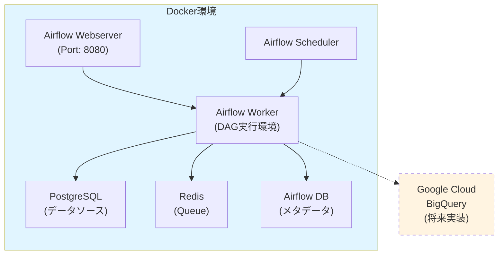
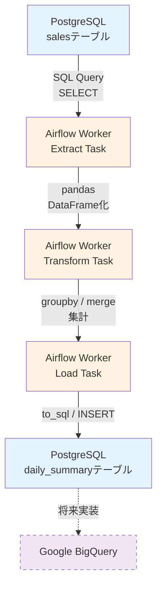
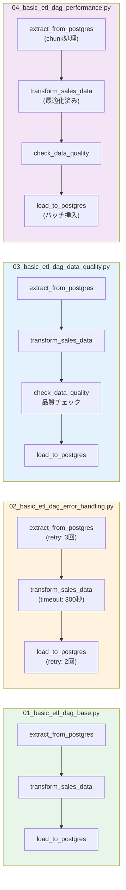
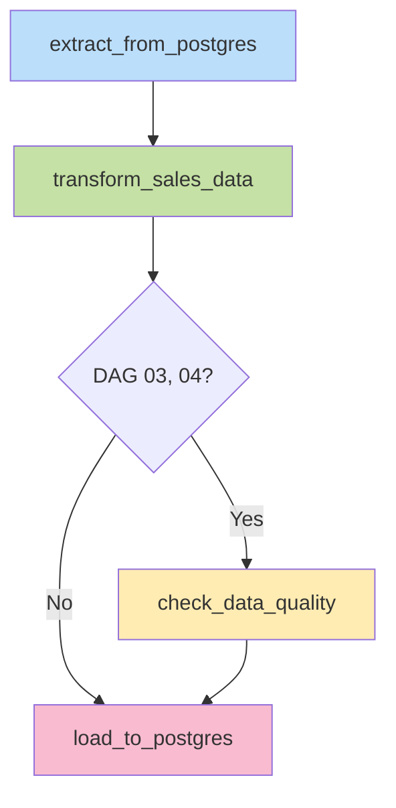

# システムアーキテクチャ

**作成日**: 2026年01月30日  
**バージョン**: 1.0  
**対象**: data-pipeline-airflow プロジェクト

---

## 📐 全体アーキテクチャ

### システム構成図



---

## 🏗️ コンポーネント詳細

### 1. Apache Airflow

#### Airflow Webserver
- **役割**: WebベースのUI提供
- **ポート**: 8080
- **機能**:
  - DAGの管理・監視
  - タスクの実行状況確認
  - ログの閲覧
  - 手動トリガー実行

#### Airflow Scheduler
- **役割**: DAGのスケジュール管理
- **機能**:
  - DAGファイルの定期的な読み込み
  - スケジュールに基づくタスク実行
  - タスクの依存関係管理
  - Worker へのタスク割り当て

#### Airflow Worker
- **役割**: タスクの実際の実行
- **機能**:
  - Pythonコードの実行
  - PostgreSQLへの接続
  - pandasによるデータ処理
  - エラーハンドリング

### 2. データベース

#### PostgreSQL（データソース）
- **役割**: ETLのソースデータベース
- **テーブル**: `sales`
- **データ**: 販売データ（商品名、金額、日付）
- **接続情報**: 
  - Host: postgres
  - Port: 5432
  - Database: airflow
  - User: airflow

#### Airflow メタデータDB（PostgreSQL）
- **役割**: Airflow自身のメタデータ管理
- **データ**:
  - DAG実行履歴
  - タスク実行状態
  - コネクション情報
  - 変数・設定

#### Redis
- **役割**: メッセージキュー（CeleryExecutor使用時）
- **機能**:
  - タスクの分散実行
  - Worker間の通信

### 3. 将来拡張予定

#### Google BigQuery
- **役割**: データウェアハウス（分析用）
- **実装予定**: Phase 5以降
- **用途**: 
  - 大規模データの保存
  - 高速な分析クエリ
  - BIツールとの連携

---

## 📊 データフロー

### ETLパイプラインのデータフロー



### データフロー詳細

#### 1. Extract（抽出）
```python
# PostgreSQLからデータ取得
df = pd.read_sql("SELECT * FROM sales", conn)

# 取得データ例
#   id | product_name | amount | sale_date
# ─────────────────────────────────────────
#    1 | ノートPC     | 89800  | 2026-01-15
#    2 | マウス       |  2980  | 2026-01-16
```

#### 2. Transform（変換）
```python
# 日付ごとに集計
summary = df.groupby('sale_date').agg({
    'amount': 'sum',
    'id': 'count'
}).reset_index()

# 変換後データ例
#   sale_date  | total_amount | product_count
# ───────────────────────────────────────────
#  2026-01-15  |     89800    |      1
#  2026-01-16  |     11880    |      2
```

#### 3. Load（読み込み）
```python
# PostgreSQLに保存
summary.to_sql('daily_summary', conn, 
               if_exists='append', index=False)
```

---

## 🔄 DAG構造

### 4つのDAGバリエーション



### タスク依存関係（基本パターン）



---

## 🐳 Docker構成

### docker-compose.yaml の構成

```yaml
services:
  postgres:       # データソース + メタデータDB
  redis:          # メッセージキュー
  airflow-webserver:   # Web UI
  airflow-scheduler:   # スケジューラー
  airflow-worker:      # タスク実行
  airflow-init:        # 初期化
```

### ボリュームマウント

```
./dags        → /opt/airflow/dags       (DAGファイル)
./logs        → /opt/airflow/logs       (ログ)
./plugins     → /opt/airflow/plugins    (プラグイン)
./config      → /opt/airflow/config     (設定)
postgres-data → (PostgreSQLデータ永続化)
```

---

## 🔐 セキュリティ構成

### 環境変数管理
- **機密情報**: `.env`ファイルで管理
- **バージョン管理**: `.gitignore`で除外
- **サンプル**: `.env.example`で構造を共有

### 接続情報
```
AIRFLOW__DATABASE__SQL_ALCHEMY_CONN=postgresql+psycopg2://...
POSTGRES_USER=airflow
POSTGRES_PASSWORD=airflow
```

### アクセス制御
- Airflow UI: `admin / admin`（デフォルト）
- PostgreSQL: Docker内部ネットワークのみ
- Redis: Docker内部ネットワークのみ

---

## 📈 スケーラビリティ

### 現在の構成
- **Worker**: 1台
- **同時実行タスク**: 16
- **データ量**: 小〜中規模（〜10万レコード）

### 将来の拡張可能性

#### 水平スケーリング
```
Airflow Worker を複数台に増やす
├─ Worker 1 (DAG A担当)
├─ Worker 2 (DAG B担当)
└─ Worker 3 (DAG C担当)
```

#### データベース分離
```
現在: PostgreSQL 1台
      ├─ Airflowメタデータ
      └─ 業務データ

将来: PostgreSQL 2台
      ├─ メタデータ専用DB
      └─ 業務データ専用DB
```

---

## 🔧 技術スタック

### コア技術
| 技術 | バージョン | 用途 |
|------|-----------|------|
| Apache Airflow | 2.x | ワークフローオーケストレーション |
| PostgreSQL | 13+ | データベース |
| Redis | 7+ | メッセージキュー |
| Python | 3.8+ | プログラミング言語 |
| Docker | 20+ | コンテナ化 |

### Pythonライブラリ
| ライブラリ | バージョン | 用途 |
|-----------|-----------|------|
| pandas | 2.x | データ処理 |
| psycopg2 | 2.9+ | PostgreSQL接続 |
| sqlalchemy | 1.4+ | ORM |
| pytest | 9.x | テスティング |

---

## 🎯 設計思想

### 1. モジュール性
- 各DAGは独立して動作
- タスクは単一責任の原則に従う
- 再利用可能な関数設計

### 2. 可観測性
- すべてのタスクでログ出力
- 実行時間の計測
- エラーの詳細記録

### 3. 信頼性
- リトライ機能
- タイムアウト設定
- データ品質チェック

### 4. 保守性
- わかりやすいコメント
- 統一されたコーディングスタイル
- 包括的なドキュメント

---

## 📝 備考

### 現在の制限事項
1. BigQuery連携は未実装
2. 本番環境用のセキュリティ設定は未実装
3. 大規模データ（100万レコード以上）は未検証

### 今後の拡張予定
1. BigQueryへのLoad実装
2. より高度なTransform処理
3. 複数ソースからのデータ統合
4. リアルタイムストリーミング対応

---

**最終更新**: 2026年01月30日  
**担当**: Makoto  
**レビュー**: Phase 4完了時
